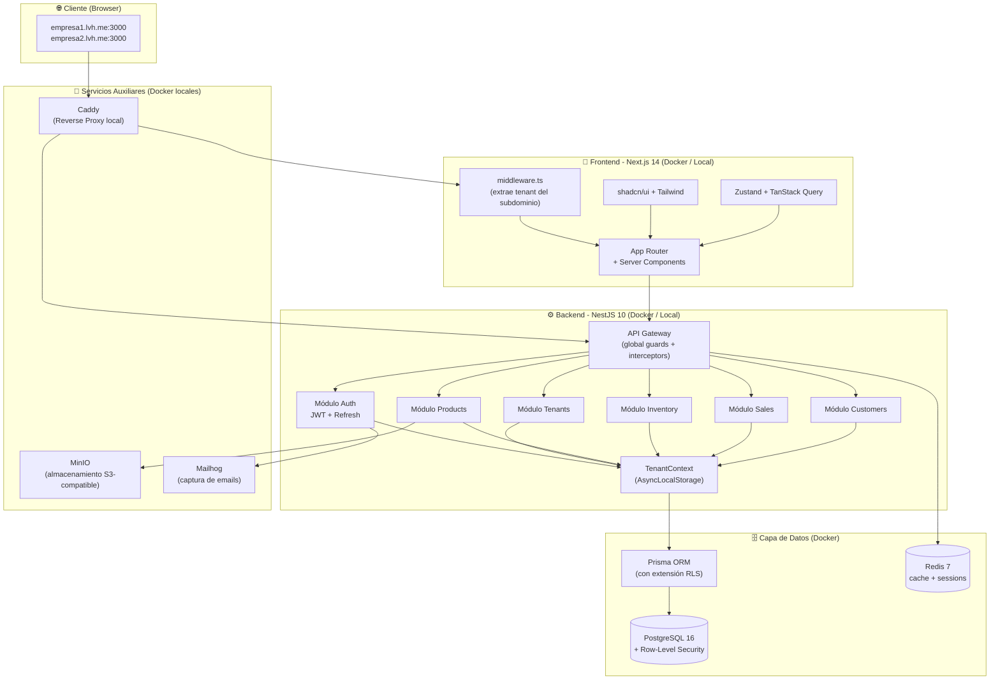

# Arquitectura Nexos ERP

## Diagrama de Componentes

## Stack Tecnológico

**Monorepo:** Turborepo + pnpm workspaces
**Frontend:** Next.js 14 (App Router), Tailwind CSS, shadcn/ui, TanStack Query, Zustand, React Hook Form, Zod
**Backend:** NestJS 10, Prisma ORM, Zod, Passport (JWT), Argon2
**Infraestructura (Local Docker):**
- PostgreSQL 16
- Redis 7
- MinIO (S3 compatible)
- Mailhog (SMTP Mock)
- Caddy (Reverse Proxy)

## Multi-Tenancy

El aislamiento se logra a nivel de base de datos usando **PostgreSQL Row-Level Security (RLS)** y un esquema compartido (`shared-schema + tenant_id`).
- El tenant se identifica por el subdominio (`tenant1.lvh.me`).
- Next.js `middleware.ts` extrae el subdominio y lo pasa en el header `X-Tenant-Slug`.
- NestJS extrae el header, busca el tenant, y usa `AsyncLocalStorage` para guardar el ID.
- Una extensión de Prisma inyecta `SET LOCAL app.tenant_id = '...'` antes de cada query.
- Las políticas RLS en Postgres garantizan que ningún tenant pueda acceder a datos de otro, incluso si hay un bug en el código de Prisma.
